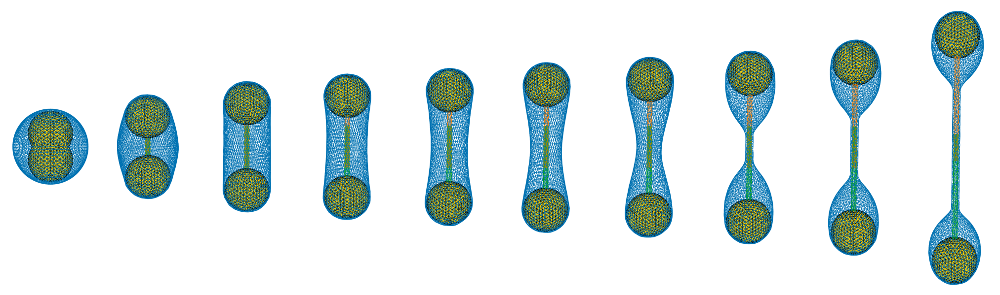

# MeshBrane



## Installation

```bash
git clone --recursive https://github.com/wlough/MeshBrane
cd MeshBrane
./install.sh
```

See `./install.sh -h` for a complete list of optional flags.

## Dependencies

Installation requires

* [Eigen](https://gitlab.com/libeigen/eigen)
* [yaml-cpp](https://github.com/jbeder/yaml-cpp)
